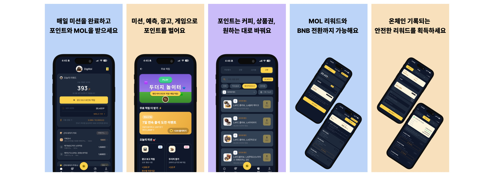
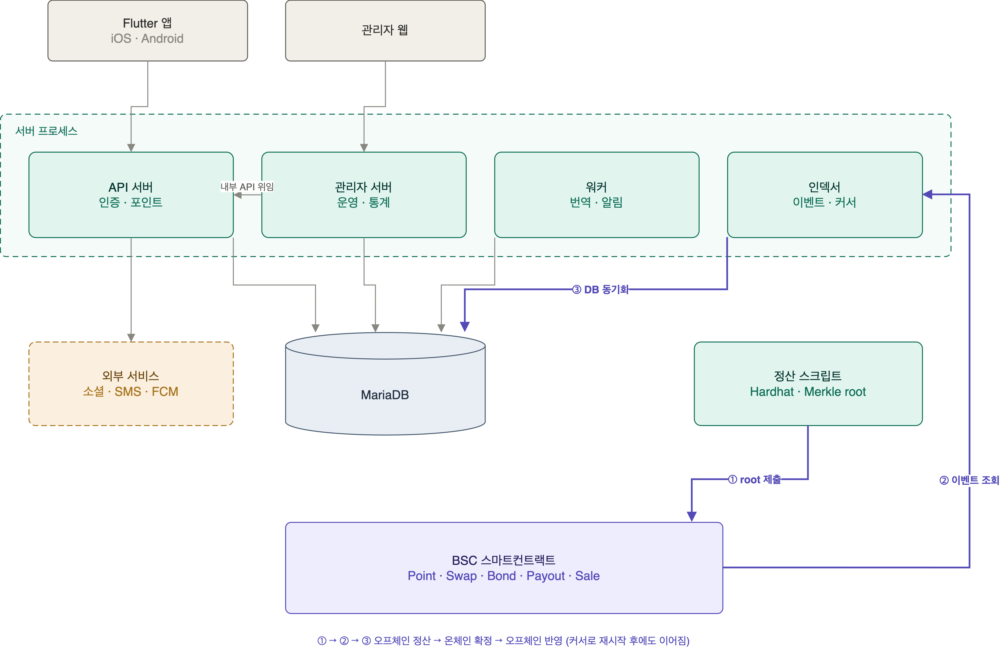
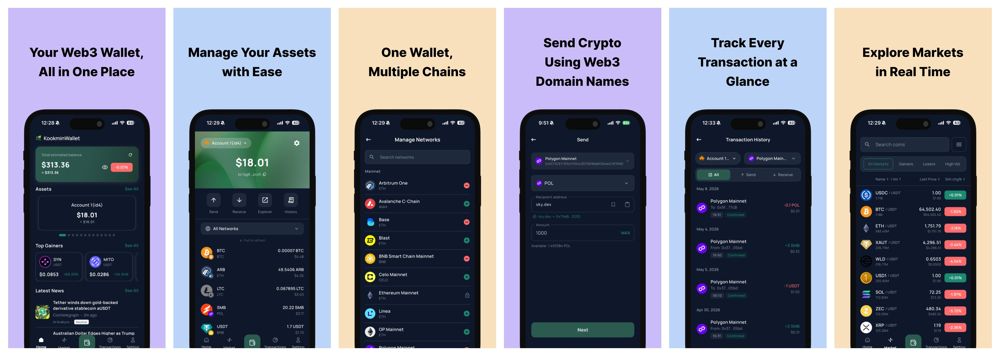
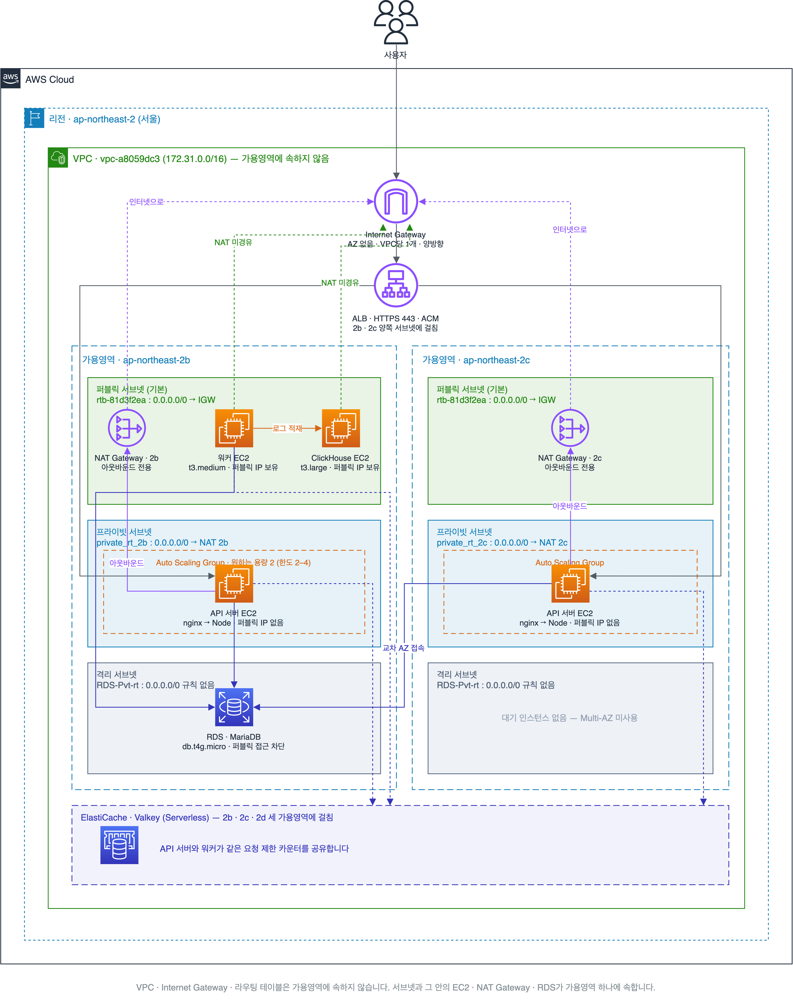
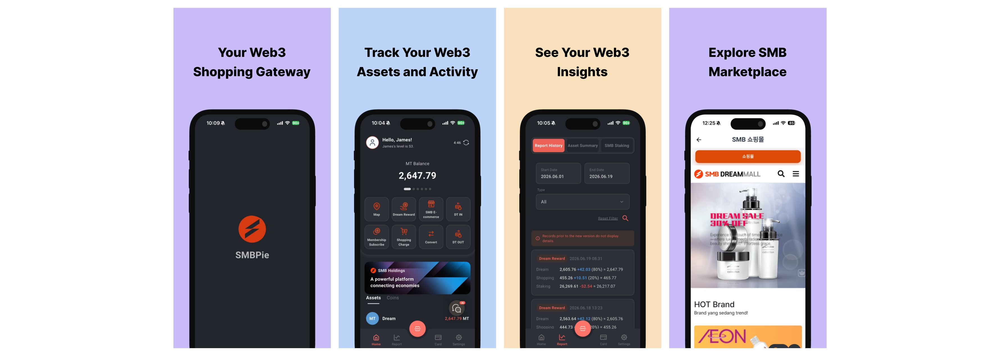
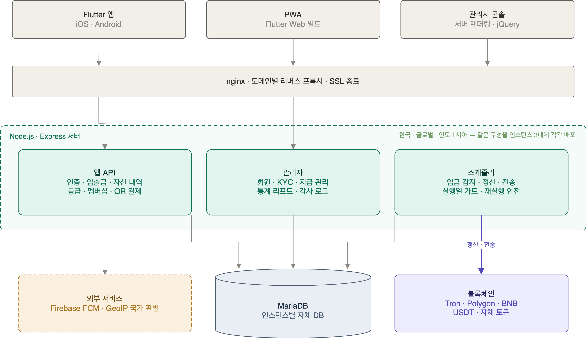
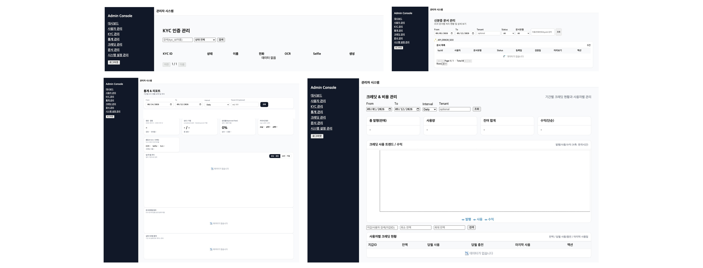
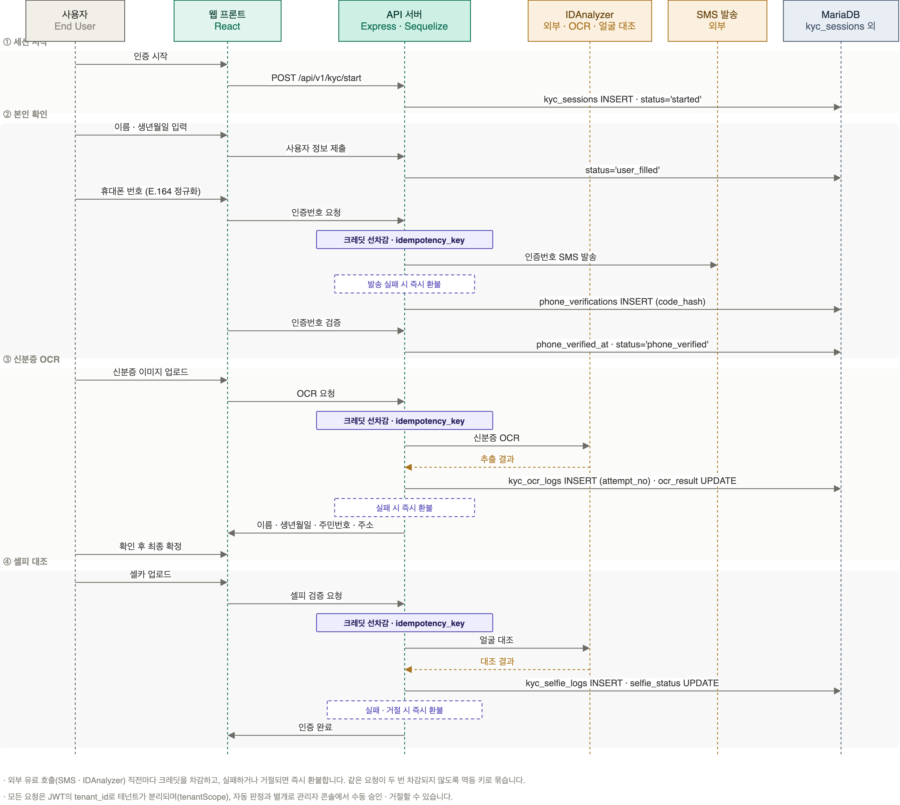
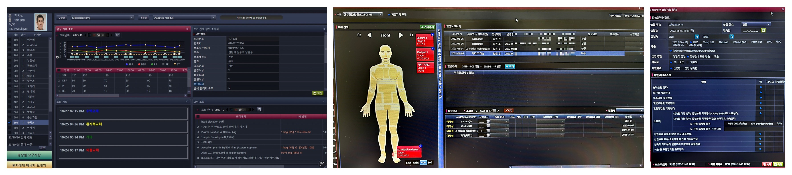

**Backend Developer · Healthcare IT · FinTech**

- **E-mail** — [wew1202@naver.com](mailto:wew1202@naver.com)
- **Location** — 서울특별시 관악구
- **Education** — 한국외국어대학교 컴퓨터공학과 졸업(2017.02) · 서울여자간호대학교 졸업(2022.02)
- **License & Clinical Experience** — 간호사 면허 취득(2022) · 대학병원 VIP병동·간호간병통합병동 근무
- **Links** — [GitHub](https://github.com/bibiana1202) · [Code & Care](https://bibiana1202.github.io/)
- **Core Skills** — Backend Development (Node.js · Express · MariaDB) · Healthcare Domain (EMR/OCS · RN License) · Cloud Infrastructure (AWS) · FinTech · Blockchain

# About

---

**💻 쓰는 사람에서 만드는 사람으로**

컴퓨터공학과 간호학, **두 가지를 모두 공부했습니다.** 오래 품어온 간호사라는 일을 해보려 간호대에 진학했고, 대학병원 병동에서 전자의무기록을 매일 쓰며 **현장에서 무엇이 불편하고 어떤 설계가 일을 막는지**를 사용자 입장에서 겪었습니다.

그 경험을 들고 개발로 돌아와 병원정보시스템을 만들었습니다. **제가 쓰던 화면을 제가 만드는 일**이었습니다. 요구사항을 그대로 옮기는 대신, 왜 그 화면이 그렇게 필요한지부터 이해하고 만들 수 있었습니다.

지금은 핀테크 백엔드에서 정산·블록체인·클라우드 인프라를 맡고 있습니다. 의료 기록도 돈 계산도 **틀리면 되돌리기 어려운 데이터**라는 점은 같았습니다. 어떤 도메인이든, **쓰는 사람을 이해하고 데이터 정합성을 지키는** 개발자가 되려 합니다.

# Experience

---

### 💰 SMB holdings · 핀테크 백엔드 개발 ( 2025.01 ~ 현재 )

> **핀테크(FinTech)** 관련 웹·모바일 애플리케이션의 **백엔드 개발**과 **시스템 아키텍처 설계**를 담당합니다.
>
> - **투자 플랫폼 SMBPIE**: 가입자 약 5천 명 규모, 추천 조직 기반 수당·등급 산정과 월 정기 정산 스케줄러를 단독 구현, 운영 중 기능 개선부터 인도네시아 현지 버전 신규 구축·데이터 이관까지 담당
> - **멀티체인 지갑 Kookminwallet**: EVM·Solana·TON·Tron·XRP·UTXO 계열을 지원하는 암호화폐 지갑 백엔드 설계 및 구현
> - **Web3 리워드 앱 DigMol**: 가입자 약 3천 명 규모, 광고·미션 적립 포인트의 온체인 토큰 전환, 추천 조직 기반 수당, 리워드 지급 로직 개발 및 운영
> - **인프라 · 배포 · 운영**: 사내 온프레미스 환경에서 개발·메일 서버를 구축·운영, AWS에서는 트래픽 증가를 고려한 Auto Scaling·ALB·RDS 자동 확장 구조와 로그·백업 체계 설계, GitHub Actions self-hosted runner로 배포 자동화

### 🏥 Ezcaretech · EMR/OCS 개발 ( 2023.01 ~ 2024.09 )

> 간호사 면허를 보유한 개발자로 서울대학교병원·보라매병원·우리들병원의 **전자의무기록(EMR)·처방전달(OCS)** 시스템을 개발했습니다. 간호기록·환자교육·투석 등 **간호 업무 영역**을 주로 담당해 의료진 요구사항을 직접 해석하고 반영했습니다.
>
> - **온프레미스 · 웹 EMR 병행**: Visual Basic 6·C# 기반 온프레미스 EMR과 웹 기반 EMR을 함께 개발·유지보수
> - **Oracle 임상 데이터**: 대용량 임상 데이터베이스 개발·운영

# Projects

---

### 🪙 Web3 리워드 서비스 백엔드 개발 - DigMol ( 2026.07 ~ 현재 )

**Tech Stack** · Node.js · Express · MariaDB · JWT · ethers.js · Solidity/BSC · FCM · Google Translation v3

> 사용자가 광고 시청·미니게임으로 적립한 포인트를 BSC 상의 **MOL 토큰으로 전환·청구**하는 Web3 리워드 애플리케이션입니다. Node.js 백엔드·Solidity 스마트컨트랙트로 구성되며, 인증·포인트 도메인 등 서버 백엔드를 담당했습니다.
>
> - **인증 · 계정 보안**: 이메일 회원가입·소셜 로그인(Apple·Google·Naver·Kakao)·JWT 인증 체계와 쿠폰 구매용 휴대폰 SMS 본인인증을 설계했습니다.
> - **포인트–토큰 전환 파이프라인**: epoch별 Merkle root로 오프체인 정산을 계산하고 온체인 claim 여부를 대조하는 Point·Swap 전환 도메인을 설계했습니다.
> - **온체인 정산 자동화**: 체인 이벤트를 주기적으로 조회하는 인덱서를 직접 구현해 오프체인 정산과 온체인 상태를 동기화하고, 이벤트 소스별 커서로 진행 위치를 관리해 재시작 후에도 이어지도록 했습니다.
> - **리워드 적립**: 피드 게시·SNS 좋아요·팔로워 지표와 걸음 수 구간별 순차 지급 리워드를 설계했습니다.
> - **다국어 콘텐츠 · 관광 정보**: Google Translation v3 번역 워커와 언어별 FCM 토픽으로 공지·예측 콘텐츠를 자동 다국어화하고, 위치 기반 관광·행사 정보(TourAPI)도 사용자 언어로 제공합니다.
> - **예측 게임 · 추천 시스템**: 환율·암호화폐·국내 주식/지수를 자산 레지스트리로 일반화해 예측 라운드 생성–마감–정산을 자동화하고, HMAC 서명 기반 단축 초대 링크·추천 관계 이력 추적을 구현했습니다.
> - **운영 안정성 · 시각 정합성**: 백그라운드 워커를 API 서버 프로세스에서 분리해 워커 실행 ID로 실행 경로를 추적하고, 시각 값이 DB 서버 타임존에 좌우되던 문제를 커넥션 단위 UTC 고정으로 해결해 앱·관리자 서버에 같은 규약을 적용했습니다.
> - **온체인 조회 · 거래내역**: 외부 RPC 사용량이 서비스 한도를 넘길 위험을 점검해 조회 구조를 개선하고, 본드 예치·언스테이크·출금 이력을 인덱서로 확장해 거래내역을 제공합니다.
> - Architecture
>
>     
>

### 🪪 멀티체인 암호화폐 지갑 서비스 백엔드 개발 - Kookminwallet ( 2026.02 ~ 현재 )

**Tech Stack** · Node.js · Express · Redis · MariaDB/Sequelize · AWS(VPC·ALB·ASG·RDS·ElastiCache) · Chainlink CCIP · ClickHouse

> EVM, Solana, Tron, TON, XRP, UTXO(BTC/LTC) 등 **7개 체인 계열**을 지원하는 멀티체인 암호화폐 지갑 서버의 핵심 백엔드를 개발했습니다. kookmin-wallet-server(REST API)와 kookmin-wallet-worker(블록체인 연동/인덱서) 두 레포지터리를 병행 개발했습니다.
>
> - **멀티체인 트랜잭션 파이프라인**: 7개 체인 계열의 잔액 조회·수수료 추정·서명·브로드캐스트를 단일 인터페이스로 추상화하고, 각 체인 네이티브 라이브러리로 서명을 직접 구현했습니다.
> - **입금 감지 · 전송 신뢰성**: Moralis·Tatum·TonAPI 웹훅으로 전 체인 실시간 입금을 감지하고, 같은 입금·전송이 두 번 처리되지 않도록 멱등성과 동시성 제어를 설계했습니다.
> - **계정 · 개인키 보안**: 소셜 로그인·2FA·Passkey 인증을 서버에 구현하고, 지갑 개인키는 AWS KMS로 암호화하되 KMS를 쓸 수 없는 환경에서는 AES-256-GCM으로 동작하도록 이중화했습니다.
> - **옴니체인 브릿지**: Chainlink CCIP로 EVM 6개 네트워크 간 자산 전송과 상태 자동 갱신을 구현했습니다.
> - **AWS 인프라 구성**: ALB(ACM·HTTPS 종료) 뒤에 Auto Scaling Group이 두 가용영역에 분산된 환경에서, 서버가 여러 대로 늘어나면 요청 제한 카운터가 인스턴스마다 따로 세어지는 문제를 ElastiCache(Valkey) 공유로 해결했습니다.
> - **네트워크 격리**: API 서버는 가용영역마다 둔 NAT를 통해서만 외부로 나가는 프라이빗 서브넷에, RDS는 인터넷 경로가 아예 없는 격리 서브넷에 배치되어 있습니다.
> - **워커 · 서버 책임 분리**: 워커를 별도 인스턴스로 분리하고, 블록체인을 직접 호출하던 구조를 서버 internal API 위임으로 리팩터링해 중복 코드 약 1만 줄을 제거했습니다.
> - **API 로그 파이프라인**: API 요청 로그를 컬럼형 분석 DB인 ClickHouse에 적재하고, 메서드·경로·상태·기간으로 조회하는 운영 로그 API를 구현했습니다.
> - Architecture
>
>     
>

### 💵 핀테크/투자 플랫폼 서비스 백엔드 개발 - SMBPIE (한국·인도네시아·글로벌) ( 2025.06 ~ 현재 )

**Tech Stack** · Node.js · Express · MariaDB · ethers.js · Polygon/Tron · Firebase FCM · AWS EC2

> 가입자 약 5천 명 규모의 투자 플랫폼입니다. **현금 입금을 정해진 비율로 코인에 배분하는 입금 정산**, **보유 코인의 현금 출금 신청**, **추천 조직 기반 수당의 온체인 지급**을 개발했습니다. 국내 버전과 글로벌 버전을 함께 맡았습니다.
>
> - **입출금 정산 · 등급 산정**: 현금 입금의 코인 배분과 출금 신청·한도 검증을 구현하고, 스테이킹 규모에 따라 회원 등급이 실시간으로 변동되도록 했습니다.
> - **온체인 수당 지급 자동화**: 추천 조직 기반 수당의 월 정기 지급에서, 체인에 보내기 전 트랜잭션 ID를 먼저 기록해 응답이 끊기더라도 중복 지급 없이 재실행할 수 있게 설계했습니다.
> - **자산 내역 · 요약 통합**: 입출금·멤버십 충전·QR 결제·수당·전환 보너스 등 성격이 다른 거래 유형을 하나의 자산 내역·요약 API로 통합하고 페이지네이션을 적용했습니다.
> - **운영 사고 대응**: 가스 충전 트랜잭션을 잘못 인식해 완료 처리된 코인 지급 건을 회수하는 스크립트를 만들고, 재발하지 않도록 회수 로직을 분리했습니다.
> - **글로벌 확장 · 현지화**: Firebase·GeoIP·QR 결제·다국어 약관으로 글로벌 버전을 구축하고, 인도네시아 버전은 통화를 루피아로, 인증을 전화번호에서 이메일 기반으로 전환했습니다.
> - **API 문서화 · 운영 안정화**: Swagger 문서화 인프라를 구축하고 스케줄러·관리자 기능을 전수 점검해 운영 버그를 수정했습니다.
> - Architecture
>
>     
>

### ☑ KYC 인증 SaaS 플랫폼 서비스 백엔드 개발 - Coxign ( 2025.02 ~ 2025.05 )

**Tech Stack** · Node.js · Express · Sequelize · MariaDB · IDAnalyzer · React · Docker/NGINX

> 신분증과 얼굴로 본인 확인을 대행하는 **KYC 인증 SaaS**입니다. 레포 초기화부터 배포까지 백엔드·프론트·관리자 화면을 **단독으로 개발**했고, Docker·NGINX 기반 배포 환경도 직접 구성했습니다.
>
> - **3단계 인증 플로우**: 휴대폰 본인인증 → 신분증 OCR → 셀피 대조로 이어지는 인증 파이프라인을 설계하고, 전화번호를 국제 표준(E.164)으로 정규화해 해외 번호도 처리했습니다.
> - **멀티테넌트 격리**: 고객사별로 인증 세션과 데이터가 서로 보이지 않도록 격리하고, 관리자 권한을 고객사 관리자와 최고 관리자로 분리했습니다.
> - **크레딧 과금**: 인증 API 호출마다 크레딧을 먼저 차감하고 실패·거절 시 즉시 환불하며, 같은 요청이 두 번 차감되지 않도록 멱등 처리했습니다.
> - **민감정보 취급 · 감사 로그**: 신분증 이미지 보관과 열람 접근 로그, 관리자 로그인 감사 로그를 남겨 누가 언제 무엇을 조회했는지 추적할 수 있게 했습니다.
> - **관리자 화면 · 통계**: 인증 관리·회원·문서·크레딧 관리와 통계 리포트를 백엔드 API부터 React 화면까지 구현했습니다.
> - Architecture
>
>     
>

### 📗 MSA 과정 팀 프로젝트 - emotionLog · FoodieHub ( 2024.11 ~ 2025.01 )

**Tech Stack** · Java · Spring · Spring Boot · Spring Security · MyBatis · Oracle · React · Nginx

> MSA 기반 자바 Full Stack 과정에서 진행한 팀 프로젝트 2건입니다.
>
> - **감정일기 EmotionLog — 감정일기 · 댓글 담당**: Spring 레거시·MyBatis·Oracle 환경에서 월별 달력 형태의 일기 조회와 등록·수정·삭제, 댓글 기능을 구현했습니다.
> - **맛집 플랫폼 FoodieHub — 백엔드 · 프론트 담당**: Spring Security로 일반·관리자 권한을 분리하고, 구글·카카오·네이버 OAuth2 소셜 로그인과 제공자 로그아웃을 구현했습니다.
> - **공공 API · 회원 도메인**: 국세청 사업자등록 조회 API를 연동하고, 중복 확인·마이페이지·프로필 이미지 업로드를 구현했습니다.
> - **배포 구성**: Nginx 리버스 프록시로 정적 프론트와 API 서버를 분리하고, 팀이 재현할 수 있게 설정 가이드를 문서로 남겼습니다.
> - **GitHub**: [emotionLog](https://github.com/bibiana1202/emotionLog) · [FoodieHub-BE](https://github.com/bibiana1202/FoodieHub-BE)

### 🏥 EMR/OCS 개발 - 대학병원 · 전문병원 ( 2023.01 ~ 2024.09 )

**Tech Stack** · Visual Basic 6 · C# / WPF · Oracle

> 전자의무기록(EMR)과 처방전달(OCS) 시스템을 개발·운영했습니다. 4개 사업장이 단일 HIS를 공유하는 환경이었습니다.
>
> - **의무기록 정정관리 전산화**: 차트·수술기록지·간호기록지 등 여러 기록 서식에 걸친 정정 이력 관리를 전산화했습니다.
> - **질병관리청 보고용 통계 개발**: 항생제 사용량 환류시스템 제출용 연령별 환자 통계를 신규 개발했습니다.
> - **Oracle 임상 데이터 운영**: 대용량 임상 데이터베이스를 운영하며 통계 집계 조건의 정합성을 개선했습니다.
> - **레거시 EMR 유지보수**: Visual Basic 6 · Oracle 기반 온프레미스 EMR의 화면과 쿼리를 개발·운영했습니다.
> - **간호 업무 화면 개발**: 간호기록·상처전담간호사 의뢰·환자교육·투석 스케줄 등 간호사가 직접 쓰는 화면을 개발·개선했습니다.

### 🤖 의료 영상 AI 프로젝트 - 병리 슬라이드 · 흉부 X-ray ( 2022.10 ~ 2022.12 )

**Tech Stack** · Python · PyTorch

> **DACON 의료 영상 AI 경진대회에서 public 4위(F1 0.841)를 기록했습니다.** 병리 슬라이드와 흉부 X-ray 딥러닝 대회 2건을 팀장으로 총괄했습니다.
>
> - **유방암 림프절 전이 예측 (DACON, public 4위 · F1 0.841)**: 병리 슬라이드 이미지와 임상항목을 함께 사용하는 멀티모달 분류 대회에 팀으로 참여했습니다.
> - **흉부 X-ray 이상 소견 탐지 (Kaggle VinBigData)**: 14개 흉부 질환을 대상으로 객체 탐지 모델을 비교한 대회에 팀으로 참여했습니다.
> - **GitHub**: [유방암 림프절 전이 예측 (DACON)](https://github.com/bibiana1202/public-4th-place-DACON-AI-competition-for-predicting-lymphadenopathy-of-breast-cancer) · [흉부 X-ray 탐지 (Kaggle)](https://github.com/bibiana1202/VinBigData-Chest-X-ray-Image-Detection)

# Training

---

### 📚 MSA 기반 자바 Full Stack 개발 전문가 양성과정 ( 2024.09 ~ 2025.01 )

> **MSA 기반 자바 Full Stack 과정**(5개월)을 이수하며 Spring Boot·JPA·Spring Security 기반 백엔드와 React를 다뤘습니다.
>
> - 사용 스택
>     - 언어 : JAVA (Oracle JDK 21)
>     - IDE : Eclipse(2024-09), VSCode, STS 3, IntelliJ IDEA
>     - 프레임워크
>         - HTML5/CSS3/jQuery
>         - ECMAScript / Ajax/ JSON
>         - JSP/JSTL
>         - Oracle, MyBatis
>         - React
>         - Spring Boot 3 / Spring JPA
>         - Spring Security  / JWT / Oauth 2.0
>         - NGINX

### 📚  딥러닝 부트캠프 ( 2022.06 ~ 2022.12 )

> 알파코 **빅데이터 기반 딥러닝 과정**(6개월)을 이수했습니다. 파이썬·머신러닝/딥러닝 기초, 텍스트 마이닝, 이미지 인식, 객체 인식, SQL을 다뤘습니다.
- 팀 프로젝트는 프로젝트 섹션의 **의료 영상 AI** 항목에 정리했습니다.
>

---

> ♻️ 최신 업데이트 · 2026.09.14
